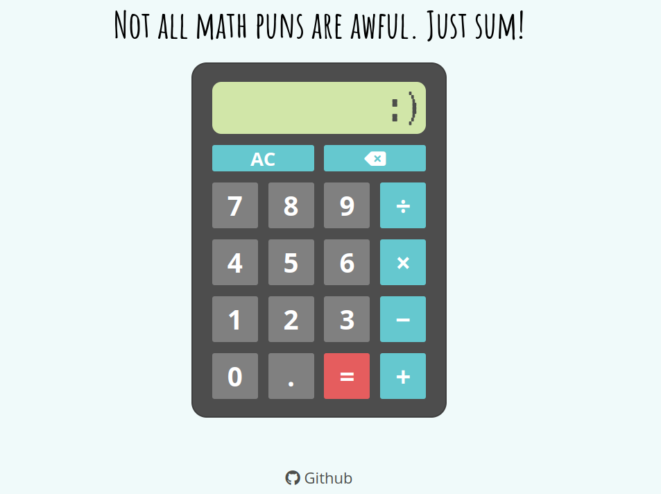

# Basic calculator
## Introduction

This project is a webpage that displays a basic functional calculator with simple math operations. It is built using the standard front-end stack of HTML, CSS and JavaScript.

The project demonstrates the integration of a variety of front-end development tools, with specific focus on JavaScript functions and manipulation of data.

## Preview

## Media credits:

1. Flaticon: https://www.flaticon.com/free-icons/math